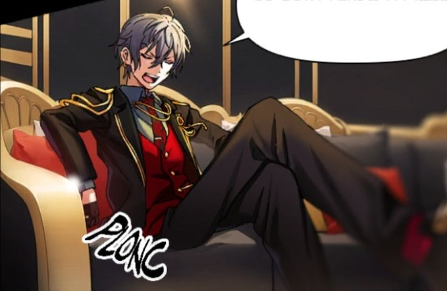

<html lang="en">
<head>
    <meta charset="utf-8">
    <meta name="author" content="Patricia Siew">
    <meta name="discription" content="a page where i go feral about romeo">
</head>

<body>
    <h1>hi lexeigh</h1>
    <h3>i though i'll introduce my new addiciton in your respond to edward</h3>
    
This is Romeo Scorpius Lucci

    

    <h3> About him</h3>
    
He's from a game call Tokyo Debunker and runs a casion.

    
Exhibit 1

    <li class="highlightedListItem">
        "he's so fucking pretty"
        "you can't lie to me."

    
Exhbit 2

</body>

 <h3>Pros and con of romeo (romi,ro-ro, lulu, our little bitchy boy)</h3>

|pro|con|
|---|---|
|he has money| he's a little shit|
|he's from "House of Lucci", which is a famous family from Italy known for their high end luxury brand| will throw insults at you like it's money|
|Will worry about your skin care routine like it's the end of the world| abbreviate *a lot* of his insults to a point when you ask what they mean, **he will insult u more**. (ex: TGA = "tiresome","good-for-nothing","asshole" (don't ask me how i remember that))|
|weapon of choice is a sniper rifle| he can shot properly.

<h1>
    
</h1>

yes lexeigh.... i am aware.... know i have horrible taste in men...

 BUT THIS IS MY DEFENSE:

<li class="highlightedlisteditem">
    i don't have one...
    
</html>
